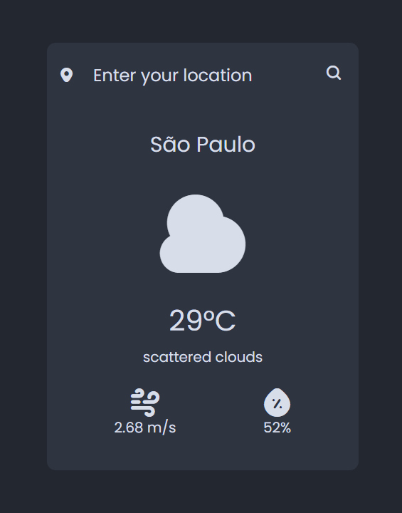

# Weather app

Neste projeto fiz um aplicativo de meteorologia, com temperatura, velocidade do vento e percentual de umidade, basta colocar o nome da cidade e pronto

Para fazer usei Html, Css, e Javascript com o auxílio de [OpenWeatherAPI](https://openweathermap.org/) para obter dados meteorológicos

[Live Demo](https://jhenriquem.github.io/weather-app/) :point_left:
